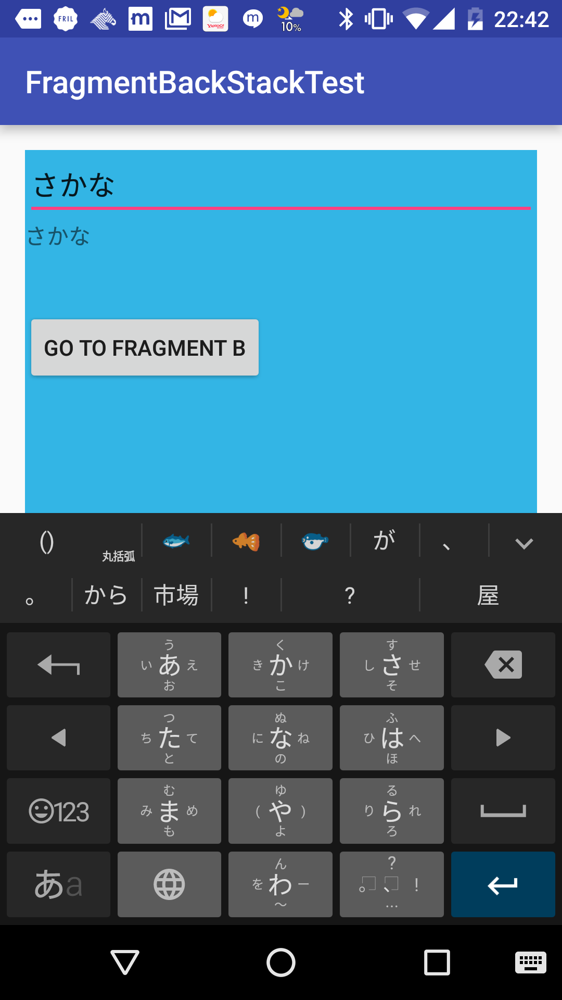
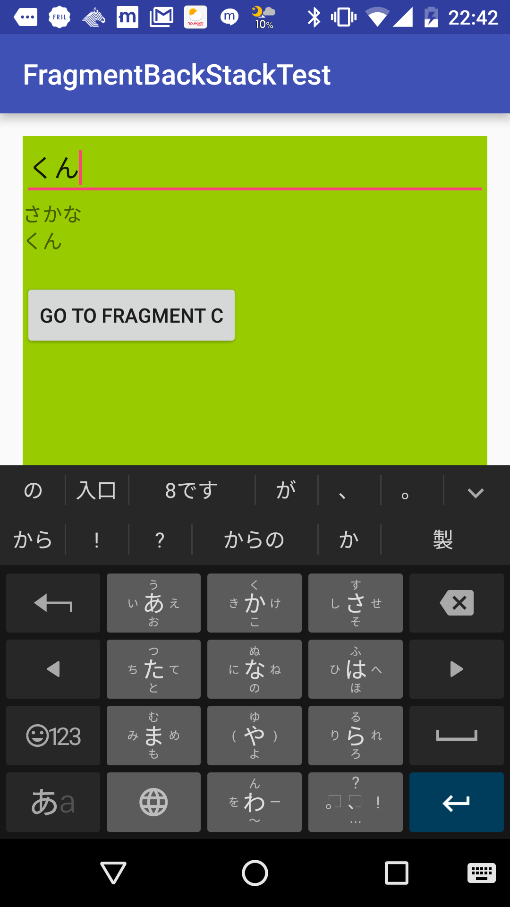
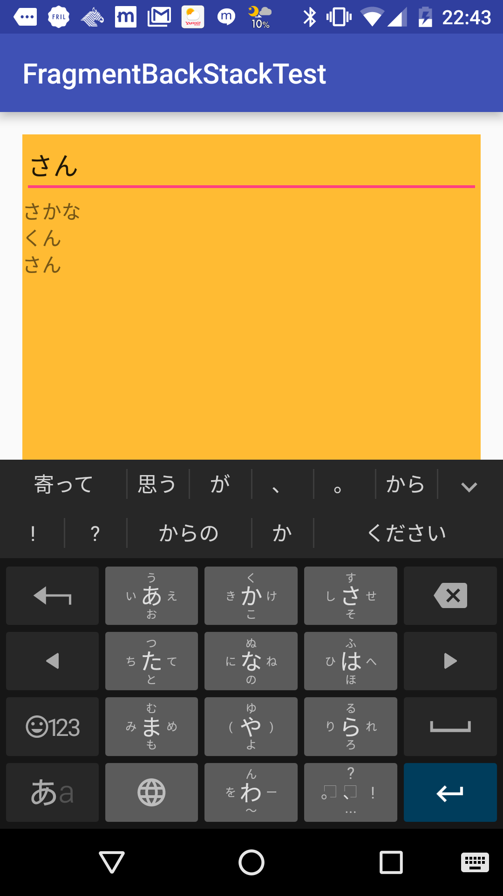
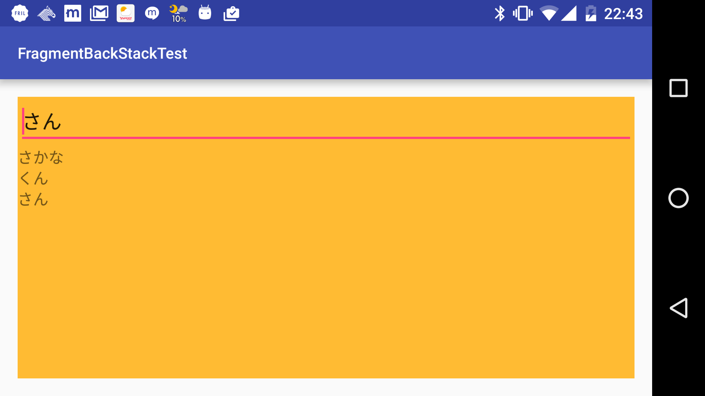
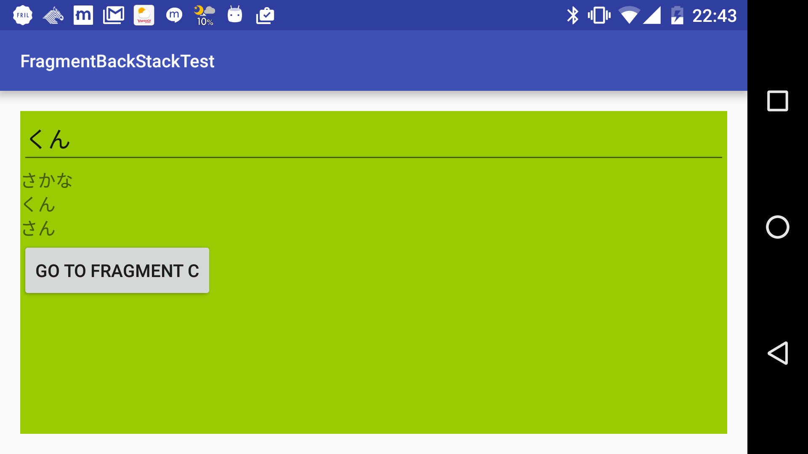
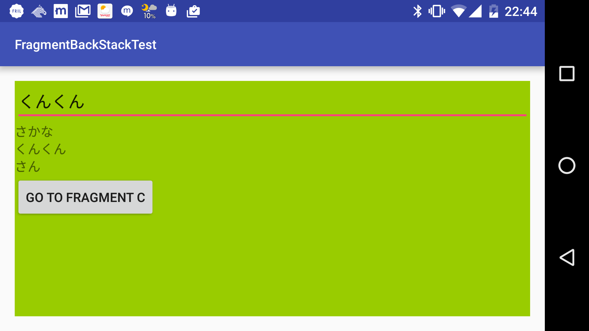
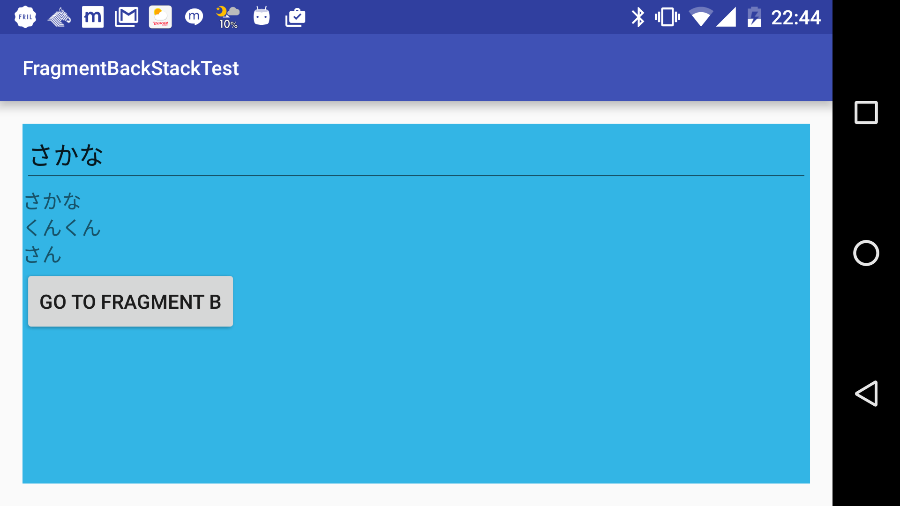
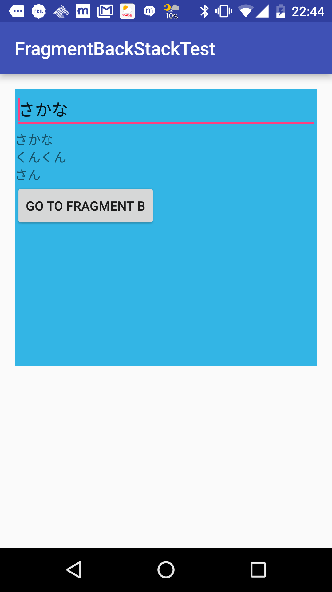

# Fragment間をmodelを渡していく調査

- 下記のようにFragment間にデータを渡していった際、それが参照渡しになるのかどうかの調査

```
    private TestModel model;

    @Override
    public void onCreate(@Nullable Bundle savedInstanceState) {
        super.onCreate(savedInstanceState);

        if (savedInstanceState == null) {
            model = (TestModel) getArguments().getSerializable("model");
        } else {
            model = (TestModel) savedInstanceState.getSerializable("model");
        }
    }
```

# サンプルの構成

- 3枚のFragment
- A -> B -> Cの順でbackstackに詰まれていく
- EditTextが一つ設置されていて、1行ずつ編集可能

# 調べたかった事
- Aで編集したものはBにも反映されるか? Cで編集してbackでBを開いた時も反映されるか?

# 結果
- 反映されます

## 詳細

- Aで "さかな" と入力


- Bに移るも、"さかな" は健在


- Cでも、A & Bの値はきちんと画面に反映されている


- 縦横回転をしてみるも、問題なし (ModelをonSavedInstanceStateで引き継いでるからね)






